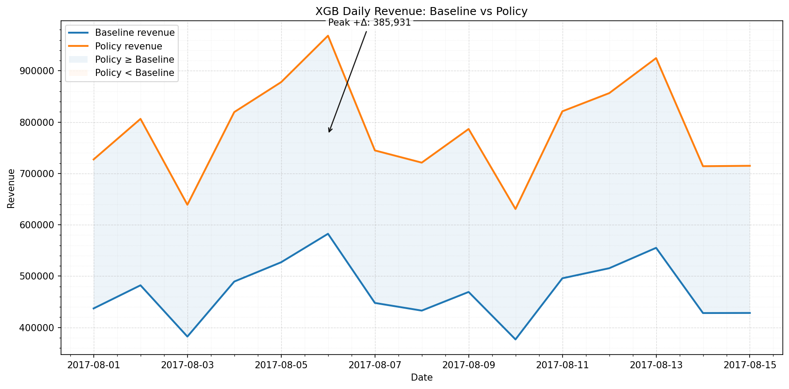
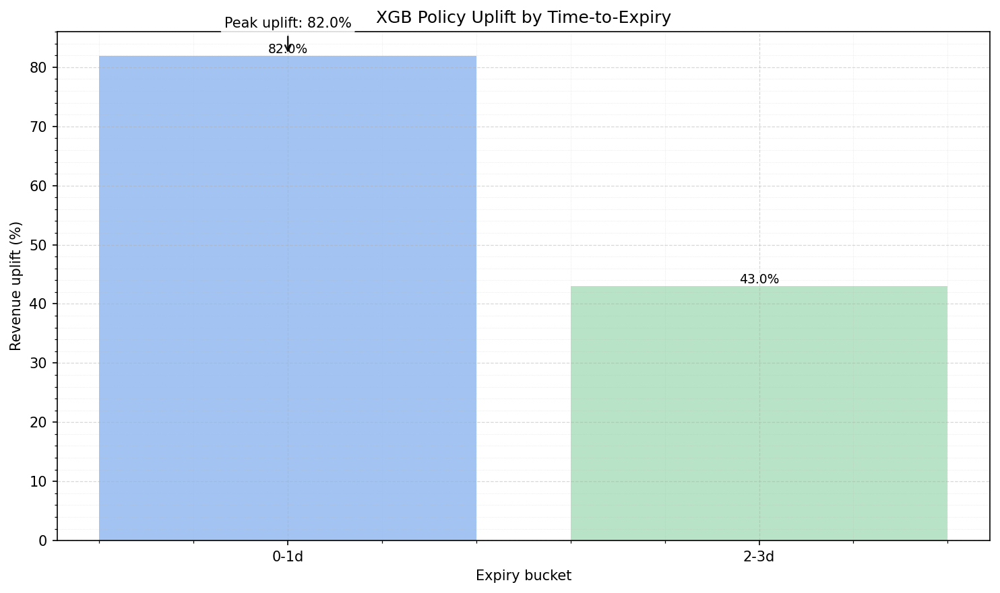

# PeriPrice — Dynamic Pricing for Perishables

> End-to-end prototype that forecasts **unit_sales**, sweeps discount candidates, and chooses the **revenue-maximizing price** per item/store/day. Stack mirrors production: **GCS → BigQuery/dbt → BQML & Compute Engine (XGBoost/LightGBM) + MLflow**. Results show **policy > baseline** most days, with strongest gains on **near-expiry** items.

---

## Table of Contents
- [Why this project ](#why-this-project-problem--motivation)
- [Data](#data)
- [What I did (data engineering → features)](#what-i-did-data-engineering--features)
- [Modeling](#modeling)
- [Models](#models)
- [Pricing policy (simulation)](#pricing-policy-simulation)
- [Results (partial)](#results-partial)
- [Visuals](#visuals)
- [Scale & Performance](#scale--performance)
- [How to reproduce](#how-to-reproduce)
- [Design choices & trade-offs](#design-choices--trade-offs)
- [What’s next (roadmap)](#whats-next-roadmap)


---

## Why this project (problem & motivation)

**Problem:** Perishable items lose value quickly. Static or ad-hoc markdowns either waste margin (too steep, too early) or miss sales (too late, too small), leading to **revenue loss and food waste**.

**Goal:** Learn a **data-driven pricing policy** that adapts discounts based on **expected demand** and **time-to-expiry**, maximizing near-term revenue while moving inventory at the right pace.

**Inspiration:** Mirrors what a Flashfood-style marketplace cares about: **reduce waste, increase sell-through, keep pricing explainable**.

---

## Data

- **Source:** Corporación Favorita public retail dataset (sales, items, stores, oil, etc.).
- **Scope:** 2013-01-01 → 2017-08-15.
- **Target:** `unit_sales` (predicted directly).
- **Focus:** **Perishable families** only.

> Prices aren’t provided. I introduce **realistic base price bands by family** and a **time-to-expiry proxy** to simulate markdown behavior. These are parameterized and documented so they can be replaced with enterprise data later.

---

## What I did (data engineering → features)

### GCS & Raw Zone
- Buckets: **`ff-landing`**, **`ff-raw`** with lifecycle rules + versioning.  
- Ingestion: uploaded Kaggle CSVs to `landing/`, then organized into `raw/` (e.g., `sales/`, `transactions/`, `oil_prices/`).
- External tables: **BigQuery external tables** over `ff-raw` for early SQL exploration.


### Curated Zone (BigQuery native) & dbt
- Migrated external → **native** BQ tables (6 sources).  
- dbt project **`periprice`** with **staging**, **intermediate**, **marts** layers.
- Sales cleaning: fix nulls, clip negatives, cap outliers at 200, add `log_sales` + calendar features.
- Dimensions:
  - `dim_items`: `item_nbr`, `family`, `class`, **`perishable` flag** (normalized family strings).
  - `dim_stores`: `city`, `state`, `type`, `cluster`.
- Oil prices: daily spine, forward-fill gaps, 7/30-day moving averages, pct changes.
- Holidays/transactions: designed but excluded from final feature set (low marginal value here).
- **Gold fact:** `fct_sales_features` (joined dims) → **filtered to perishable** items.
- **Feature inventory:** YAML documenting each feature, definition, & leakage status.

### Price & Expiry (simulated, documented)
- **Base price bands** by family (`p_min`/`p_max` + mild item-level randomness).
- **Time-to-expiry** proxy from family shelf-life priors (consistent hashing).
- **Baseline markdown** fields: `baseline_discount_pct`, `baseline_effective_price` for policy comparison.

---

## Modeling

**Features (train & inference):**
- **Price/expiry:** `effective_price`, `discount_pct`, `time_to_expiry`, `base_price`
- **Autoregressive:** `lag{1,7,14,28}_log_sales`, `rm{7,28}_log_sales`, `promo_in_last_7d`
- **Calendar:** `dow`, `month`, `year`
- **Categoricals:** `family`, `class`, `store_nbr`, `cluster`
- **Target:** **`unit_sales`** (direct), not log-sales.

> Lags/rolling means computed **causally** (end at 1 PRECEDING) to avoid leakage. At inference, they’re available from historicals.

---

## Models

- **BQML** (baseline): fast iteration with boosted trees in BigQuery.
- **Compute Engine (CE):** **XGBoost** & **LightGBM**, **native categoricals** (no one-hot) + histogram trees → fits ~**30M** rows on a **32GB** VM.
- Numerics downcast to `float32` / small ints.
- Training & artifacts tracked in **MLflow**.
- **Same features & target** across BQML/XGB/LGBM for strict comparability.

---

## Pricing policy (simulation)

For each **(date, store, item)** in test:
1. Candidate discounts: **[0.0, 0.1, 0.2, 0.3, 0.4, 0.5]**.  
2. `cand_effective_price = round(base_price * (1 - discount), 2)`.  
3. Set `effective_price`/`discount_pct` = candidate; keep other features fixed.  
4. Predict **`unit_sales`**; compute **expected revenue** = price × predicted_units.  
5. Choose **argmax revenue** candidate ⇒ policy price.  
6. Predict **baseline** revenue at `baseline_effective_price`.  
7. Aggregate KPIs: **daily revenue**, **uplift%**, **uplift by expiry bucket**.

---

## Results (partial)

- **Policy > baseline** most days of test window.  
- Biggest gains in **0–3 days to expiry** (where sell-through risk is highest).  
- **Consistent signal across models** (BQML, XGB, LGBM).  
- **Runtime:** fast on **e2-standard-8** via native categoricals + per-day (and sharded) sweeps.

---

## Visuals

> All images live under `reports/viz/`. 

- **For example, XGBoost**
 



---

## Scale & Performance


- **Time window:** 2013-01-01 → 2017-08-15  
- **Rows (perishables-only):**
  - Train: `~ 30 million` rows
  - Valid: `~ 400k` rows
  - Test:  `~ 400k` rows
- **Cardinality:** `950` unique items, `54` unique stores (test)
- **Compute:** BQML; CE **e2-standard-8 (8 vCPU, 32 GB)**; XGB/LGBM with native categoricals & histogram trees.


## How to reproduce

> These steps rebuild features, train models (BQML, XGBoost, LightGBM), and run the pricing policy sweep.

### 0) Environment & auth
```bash
# Python 3.10+ recommended
python -m venv .venv
source .venv/bin/activate  # Windows: .venv\Scripts\activate

pip install -r requirements.txt  # if present
# or install directly:
pip install google-cloud-bigquery pandas-gbq mlflow xgboost lightgbm python-dotenv matplotlib

# GCP auth for BigQuery access
gcloud auth application-default login 
```


### 1) Build ML features (dbt + SQL)
Creates/updates the ML dataset, cleaned/enriched features, and train/val/test splits.
```bash
bash scripts/build_ml_features.sh
# runs: dataset.sql → features_clean.sql → features_enriched.sql → features_split.sql
```

### 2) (Optional) BQML baseline
```bash
bq query --use_legacy_sql=false --project_id="$PROJECT" --location="$LOCATION" < ml/bqml/bqml_train.sql
bq query --use_legacy_sql=false --project_id="$PROJECT" --location="$LOCATION" < ml/bqml/policy_sweep_daily.sql
bq query --use_legacy_sql=false --project_id="$PROJECT" --location="$LOCATION" < ml/bqml/bqml_kpis.sql
```

### 3) Train on Compute Engine (or locally) — XGBoost & LightGBM
```bash
# XGBoost (native categorical; memory-efficient)
python ce/src/xgboost_train_cat.py --project "$PROJECT" \
  --model_out models/xgb_cat.json \
  --cat_vocab_out models/xgb_cat_vocab.json

# LightGBM (native categorical)
python ce/src/lightgbm_train_cat.py --project "$PROJECT" \
  --model_out models/lgbm_cat.txt \
  --cat_vocab_out models/lgbm_cat_vocab.json
```

### 4) Policy sweep (same logic/grid as BQML)

Writes a CSV locally and (optionally) a BigQuery table for KPIs. 
```bash
# XGBoost sweep
python ce/src/policy_sweep_xgb_cat.py \
  --project "$PROJECT" \
  --model_path models/xgb_cat.json \
  --cat_vocab_path models/xgb_cat_vocab.json \
  --start_date 2017-08-01 --end_date 2017-08-15 \
  --discount_grid 0.0,0.1,0.2,0.3,0.4,0.5 \
  --num_shards 4 \
  --write_bq --bq_table dynamic_pricing_ml.xgb_policy_eval_test

# LightGBM sweep
python ce/src/policy_sweep_lgbm_cat.py \
  --project "$PROJECT" \
  --model_path models/lgbm_cat.txt \
  --cat_vocab_path models/lgbm_cat_vocab.json \
  --start_date 2017-08-01 --end_date 2017-08-15 \
  --discount_grid 0.0,0.1,0.2,0.3,0.4,0.5 \
  --num_shards 4 \
  --write_bq --bq_table dynamic_pricing_ml.lgbm_policy_eval_test
```


## Design choices & trade-offs

- **No feature store (for now).** Portfolio project on free tier; dbt + BigQuery are sufficient & reproducible. Easy to upgrade to Feast later.
- **Native categoricals > one-hot.** Avoids memory blow-ups on ~30M rows; faster and typically as accurate for tree models.
- **Unit-sales target.** Keeps policy simple and direct: revenue = price × predicted units.
- **Explainable policy.** Fixed discount grid + argmax revenue per item/day; easy to review and constrain.

## What’s next (roadmap)

### Short-term
-  **Tests**
    - dbt: schema/data tests, freshness, row-level checks
    - Python: `pytest` for featurization & policy logic; sample-based regression tests
-  **CI/CD (GitHub Actions)**: lint, unit tests, dbt compile, MLflow artifact upload
-  **More KPIs**: margin/profit sensitivity (with cost), price-change stability, discount distribution QA

### Medium-term
-  **Constraints**: price monotonicity, floors/ceilings, discount cadence
-  **Serving**: batch scoring to a table/API; store-level dashboards

### Long-term
-  **Cold-start** for new items/stores
